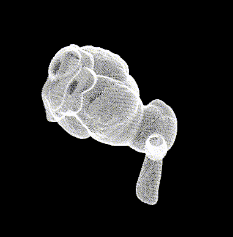

# trimesh.aya

Aya script to load and render obj files

## Install

Install via the package manager

```
aya pkg add nick-paul/trimesh.aya
```

Or, from within aya directly:

```
aya> import pkg
aya> "nick-paul/trimesh.aya" pkg.add
```

## Demo

Then run the demo

```
aya> "trimesh" pkg.run
```



## API


